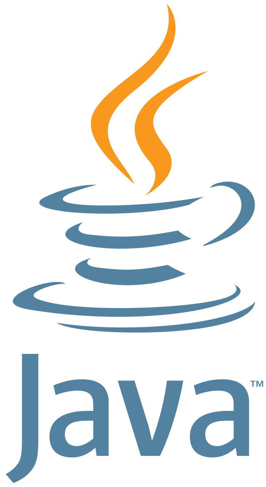

## Hi there 👋, I am Indrajeet!

I'm a dedicated full stack Java web developer with a passion for creating efficient and scalable applications. My expertise lies in backend development, where I focus on designing robust systems and delivering production-ready products. On the frontend, I mainly work with React to build intuitive and engaging user interfaces.

---

## Languages and Technologies

	
    
    
    
    

## Skills, I've

- **Programming Languages** : Java, JavaScript, Python, SQL
- **Frontend**: HTML, CSS , react
- **Backend**: Spring Boot, Hibernate, JPA
- **Databases**: MySQL, MongoDB
- **Tools**: Git, Docker
- **Soft Skills**: Problem-solving, Team collaboration

## 🌱d I'm currently Learning

- Micro services with Spring boot
- Machine Learning(ML)
- Basic of Unix/Linux

---
 

## 💬 Ask me about backend development, Java, React, or any tech-related topic.
